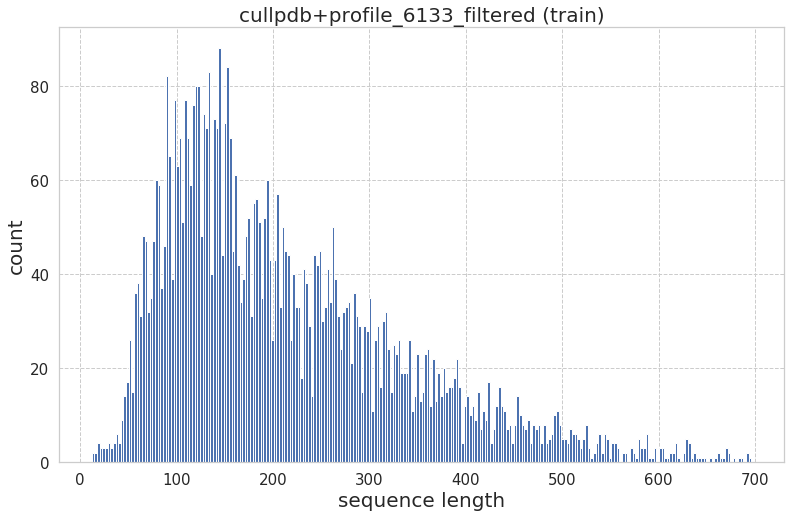
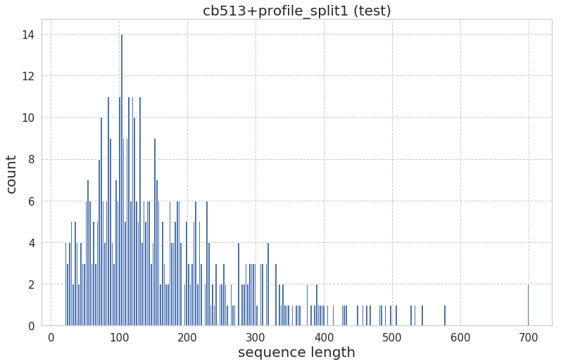
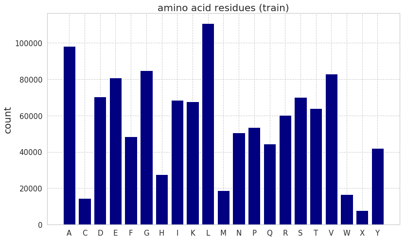
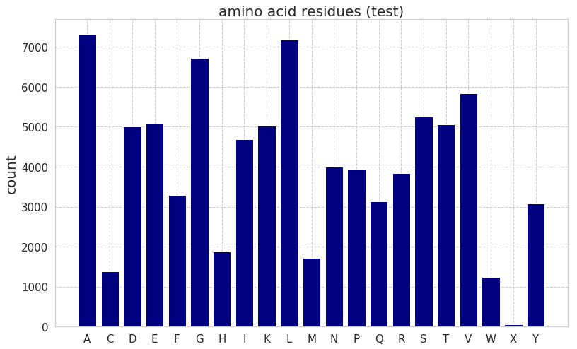
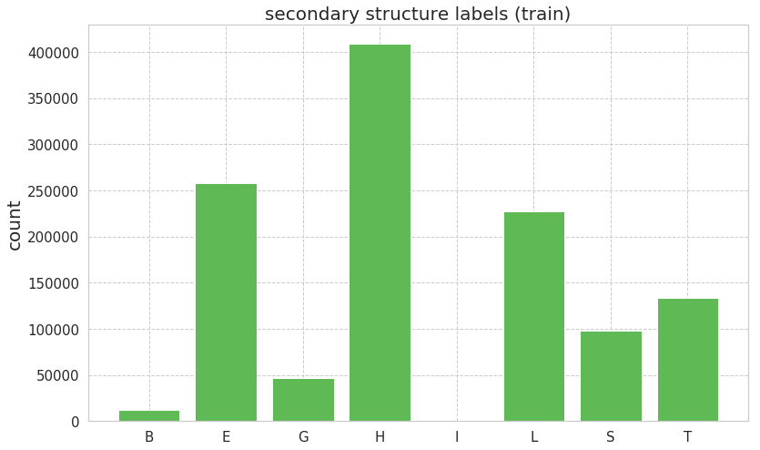
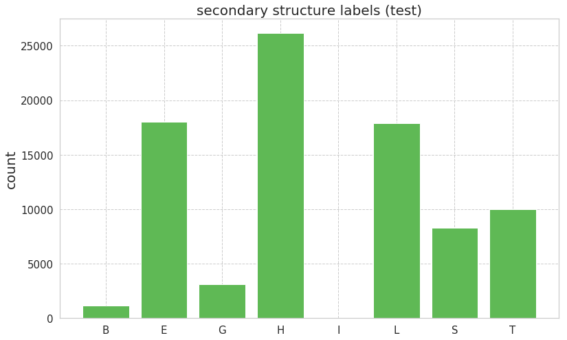

# Protein secondary Structure Prediction in Deep Learning

PyTorch implementations of protein secondary structure prediction on CB513.

This implementation is based on https://github.com/alrojo/CB513 and https://github.com/jadore801120/attention-is-all-you-need-pytorch.

## Dataset

I used CB513 dataset of https://github.com/alrojo/CB513.

|sequence length (train)|sequence length (test)|
|:-:|:-:|
|||

|amino acid (train)|amino acid (test)|
|:-:|:-:|
|||

|secondary structure label(train)|secondary structure label (test)|
|:-:|:-:|
|||

## Usage

You can get more infomations by adding `-h` option.

### pssp-nn

```
python main.py
```

### pssp-transformer

```
python preprocess.py
python main.py
```

## Acknowledgement

- https://github.com/alrojo/CB513 
- https://github.com/jadore801120/attention-is-all-you-need-pytorch
- [Li, Zhen; Yu, Yizhou, Protein Secondary Structure Prediction Using Cascaded Convolutional and Recurrent Neural Networks, 2016.](https://arxiv.org/pdf/1604.07176.pdf)
- [Ashish Vaswani, Noam Shazeer, Niki Parmar, Jakob Uszkoreit, Llion Jones, Aidan N. Gomez, Lukasz Kaiser, Illia Polosukhin, Attention Is All You Need](https://arxiv.org/abs/1706.03762)
